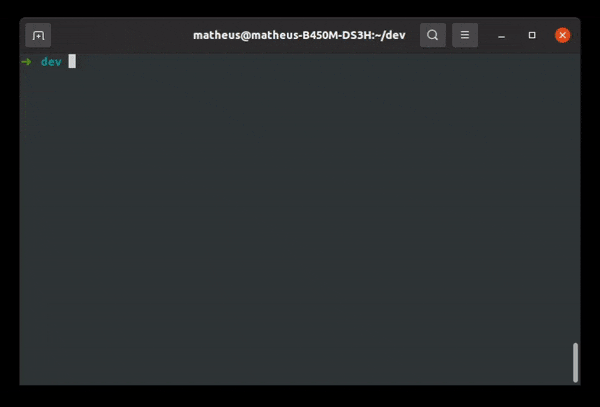
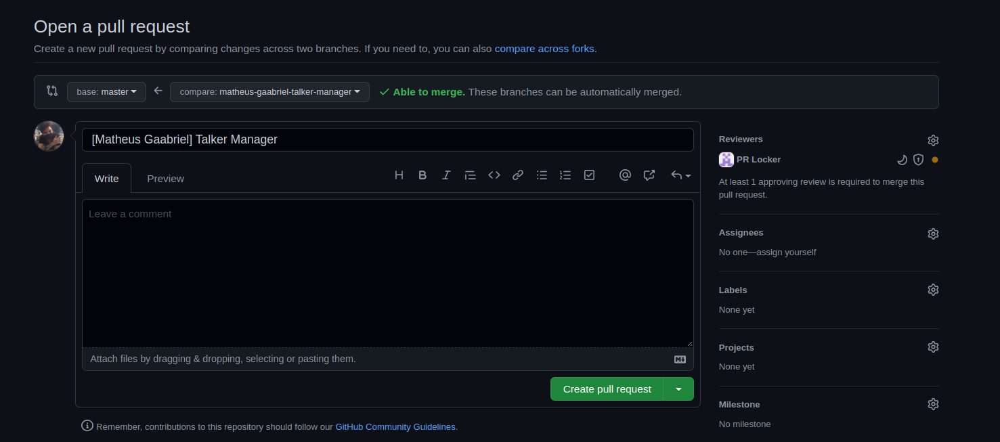

# trybe-prj

A ferramenta que cria um PR estilo trybe para os projetos.

O trybe-prj é um pacote executável do npm (npx) que automatiza as tarefas de início de um projeto da Trybe. O que ele faz:

1. Clona o projeto
2. Faz o `npm install`
3. Cria a branch no padrão Trybe
   `nome-sobrenome-nome-do-projeto`
4. Cria uma PR com o padrão Trybe (opcional)
   `[Nome Sobrenome] Nome Do Projeto`
5. Abre o VScode no projeto (opcional)

## Instruções

Rodando `npx trybe-prj` no terminal você inicia o projeto na sua pasta atual. Mas existem algumas opções extras para turbinar o comando:

- Escolher o caminho do projeto (o path do git clone): `npx trybe-prj {pasta-do-projeto}`

  ```bash
  npx trybe-prj projeto
  ```

- Adicionar a flag `--pr` para abrir o navegador já na página de PullRequest do GitHub

  ```bash
    npx trybe-prj --pr
  ```

- Adicionar a flag `--code` para abrir o VScode na pasta do projeto

  ```bash
    npx trybe-prj --code
  ```

- Você pode usar as tags que quiser 😁

  ```bash
    npx trybe-prj --pr --code projeto
  ```

## Exemplo de funcionamento

Rodando `npx trybe-prj --pr --code talker-manager`:



Ao final abre o link da PR e abre o VScode



## Considerações finais

Para dúvidas ou feedbacks eu estou a 1 slack de distância! 🚀
